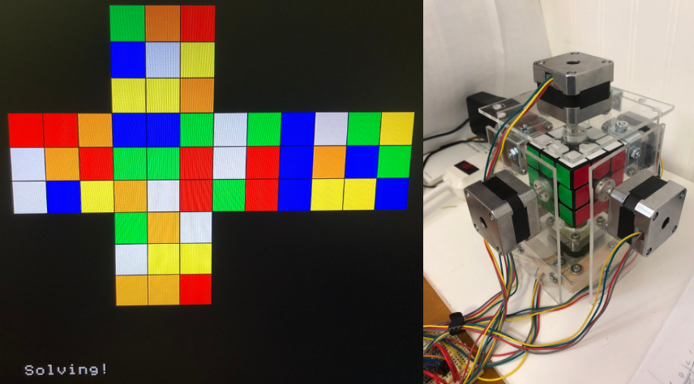
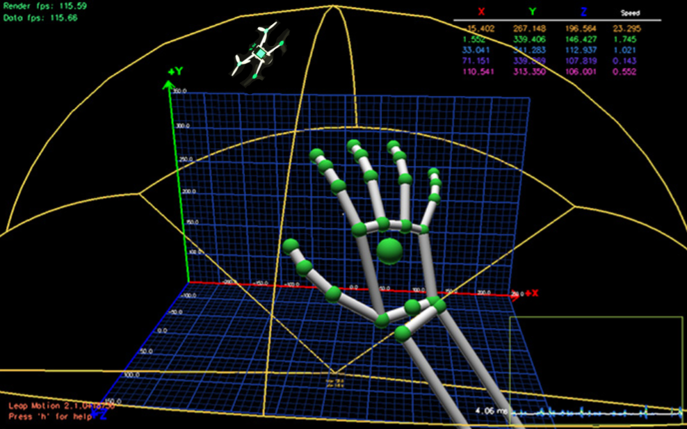
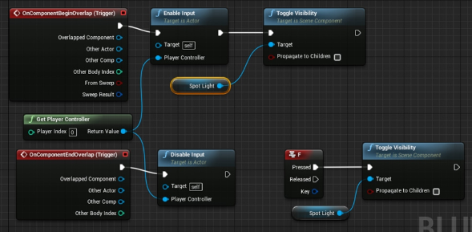
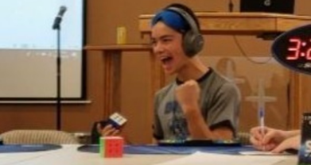

### **Cubot**

**A Rubik's Cube Solving Robot**

Programmed and constructed a Rubik’s Cube Solving Robot built on top of a **Raspberry Pi** in bare-metal **C**. Wired a circuit powering 6 servomotors that precisely turn each face of the cube on command. Wrote a custom solver using **3-style**, the blindfolded method that I'm currently learning, which conveniently produces solve times that match my sighted 3x3 abilities (9-12 seconds).

This was a final project for a Computer Systems class in Spring 2020. Code [available here](https://github.com/rickyparada6/cubot){:target="_blank"}. Video demonstration [available here](https://drive.google.com/file/d/1XExxEtymkB8IOTkzh1MUYkfTPDjp26yx/view?usp=sharing){:target="_blank"}. Ricky vs Cubot race [here](https://drive.google.com/file/d/10ePE3w9q7iAAHHokkwFTI6F_EAa1Ruq2/view?usp=sharing){:target="_blank"}.

---

### **Wingman Control**

**A Single Hand Manual UAV Controller**

Integrated palm/finger positional tracking using the **Leap Motion SDK** to fully control a UAV in **Gazebo** simulation or live. Mapped trajectory inputs and smoothed sequences such as roll, pitch, yaw, throttle, 360 flip, takeoff, and landing using the **Robot Operating System (ROS)** in **Python** and **C++**.

This project was part of an internship at **Beyond Vision** in the summer of 2019. Code is publicly unavailable.

---

### **VR Gladiator UI**

**Multiplayer Platform User Interface Design**

Created a User Interface (UI) for a multiplayer Virtual Reality (VR) Platformer "VR Gladiator" using **Unreal** (scripting in **C++**). Designed pause menu layout and player interaction with VR controllers using the Unreal's VR Expansion Plugin. Gained familiarity with VR game development in **Unity** (scripting in **C#**) through a series of small onboarding projects.

This project was part of an internship at **ZPX - Interactive Software** (now **Funcom ZPX**) from summer 2018 to spring 2019. Code is publicly unavailable.

---

### **Speedcubing**

**Competitive Rubik's Cube Solving**

Regular participant and staffer of regional/national speedcubing competitions regulated by the **World Cube Association** (WCA). Competitive on a national level in blindfolded (BLD) events, ranking 57th in the US as of February 2024. Favorite event is 3x3 Multi-Blind, testing how many 3x3's you can solve consecutively blindfolded in under an hour- a true test of one's memory, mental fortitude, and composure. Some noteable (at home) personal bests: **3x3- 7.09; 3x3 BLD- 42.34; Multi-Blind- 16/16 in 59:06.45**.

My WCA profile [available here](https://www.worldcubeassociation.org/persons/2018PARA15?event=333mbf){:target="_blank"}. Semi-recent Multi-Blind attempt [available here](https://drive.google.com/file/d/1uUi9wZOPU9IS58P6kI1puEFA8WDebOZJ/view?usp=sharing){:target="_blank"}.

---

### **Long Distance Running**

**5k/Half Marathon/Marathon Running**

Avid long distance runner specializing in marathons, racing the hilly San Francisco Marathon in 2021 and 2023. Current personal best is **3:23:48**, which converts to 7:47 pace (per mile). This result placed me in the top 7% overall and top 13% for my gender/age group. I hope to one day run a sub-3 hour marathon and qualify for the Boston Marathon.

San Francisco Marathon result [available here](https://www.athlinks.com/event/1403/results/Event/1052040/Course/2367906/Bib/1361){:target="_blank"}.

---

### **Course Final Projects**

**Miscellaneous Writeups and Presentations**

Writeups: [Applying machine learning algorithms to identify and classify brain scans as having a risk of Alzheimer's disease](https://cs229.stanford.edu/proj2021spr/report2/82006956.pdf){:target="_blank"}
[Musical Local Conditioning for WaveNet](https://cs230.stanford.edu/projects_spring_2022/reports/127608644.pdf){:target="_blank"}
[Simple Hash Functions](https://drive.google.com/file/d/1DKmONHj0UUC3jemYOHopdVcQ7CRVfWOD/view?usp=sharing){:target="_blank"}
[GHZ state Encoding and quantum decoherence](https://drive.google.com/file/d/1nv1g3ZisPElbNo2EimdGxHr-2kBk_pCq/view?usp=sharing){:target="_blank"}
[Average-Case Complexity](https://drive.google.com/file/d/1X3Ks58fdjeisPdB9_hIl2QrD5eXNcBHV/view?usp=sharing){:target="_blank"}
[A Qatar Case Study: World Cup Seeding and the Fairness Implications of a Weak Host Nation](https://drive.google.com/file/d/1Nc_LqauGDCs4BrcSXA_n7BI8OicZTvV4/view?usp=sharing){:target="_blank"}
[Optimal Policy for Ground-to-Satellite Communication using Reinforcement Learning](https://drive.google.com/file/d/1wGFW5xqyl3DYfkYzNm3d31UktLjY5QZD/view?usp=sharing){:target="_blank"}
[On the complexity of Primality](https://drive.google.com/file/d/1-xd0q4-8gnB8EDwVik_hrTKxoXTA1vJA/view?usp=sharing){:target="_blank"}
[Equivalence class distribution in asymmetric credit networks](https://drive.google.com/file/d/1-xd0q4-8gnB8EDwVik_hrTKxoXTA1vJA/view?usp=sharing){:target="_blank"}

Presentations: [Fermi-Dirac Statistics Exploration](https://drive.google.com/file/d/1nK3qHI0AabHFcCiUFBvVE2EtyLQ2bkCH/view?usp=sharing){:target="_blank"}
[Amplitude Estimation in Braket](https://drive.google.com/file/d/1qz9l5QYwksFFHdOxyDR7tYz5fB65UG8-/view?usp=sharing){:target="_blank"}
[Fast universal control of an oscillator with weak dispersive coupling to a qubit](https://drive.google.com/file/d/1oY30cefBjb9f2v-LJ2IuYkysEnRuqWVx/view?usp=sharing){:target="_blank"}
[Non-Isometric Codes for the Black Hole Interior](https://drive.google.com/file/d/1Xxc2CjuEzq62XxG_je3-UZ5xg3txO51I/view?usp=sharing){:target="_blank"}