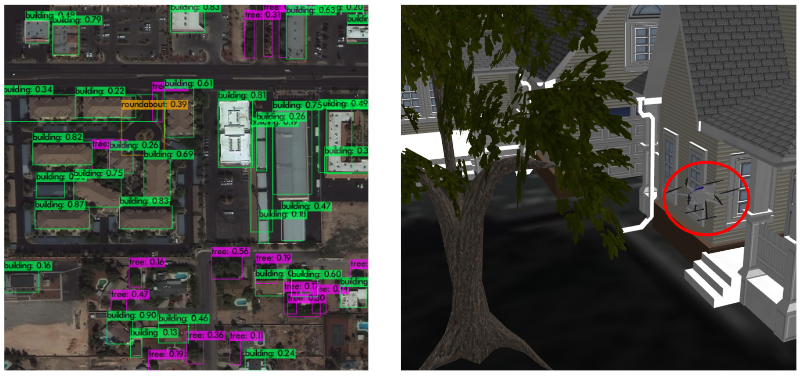

<!-- _pages/research.md -->

---

### **State Propogation Modeling**

**Prof. Hideo Mabuchi, *Stanford University* (January 2024 - Present)**

Writing **QuTiP** software to characterize state propogations from Quantum Input/Output Networks (QIONs) using SLH. We aim to quantify the advantage of a coherent controller in a variety of optical systems that reside in the **nonlinear regime**. Viewing optomechanical sensors as control systems, these results could inform the noise levels displayed by such devices.

---

### **Qubit Module Design**

**Prof. Oskar Painter, *California Institute of Technology* (June 2023 - September 2023)**

Converged on qubit module parameters that optimize the transfer fidelity of a flying photon emitted by an **optomechanical transducer**. Performed detailed error analyses to mitigate the effeciency drop due to multiple loss channels. I further prototyped several physical layouts with distinct qubit geometries in **Sonnet** to determine which configurations were physically realizable.

Paper unsubmitted, but [available here](https://drive.google.com/file/d/1bgm7kcSLPthreUVNKtpM3ocQH3rYKbDT/view?usp=sharing){:target="_blank"}. Presentation slides [available here](https://drive.google.com/file/d/1FCuTOX9cTHbK8wTdKeeZ2OEKtDYs-jmb/view?usp=sharing){:target="_blank"}.

---

### **Birifringent Material Classification**

**Prof. Felipe Herrera, *Universidad de Santiago de Chile (USACH)* (June 2022 - August 2022)**

Classified birifringent materials based on their refractive indices using a **feed-forward Neural Network (NN)** trained solely on optical information. Determined input data in the form of Mueller matrices and Brewster's angles in reflection using polarimetry techniques. Engineered **loss landscapes** of a fixed window centered around Barium Borate (BBO) with varying resolution to measure the model's extrapolation ability.

Preprint in progress, to be submitted to [Optics Continuum](https://opg.optica.org/optcon/journal/optcon/about.cfm){:target="_blank"}. Presentation slides [available here](https://drive.google.com/file/d/1M3Pf-JbvTxUSwoPGReYcSEIhvULLXeuq/view?usp=sharing){:target="_blank"}.

---

### **Vanadium Phase Diagram Computation**

**Prof. David Goldhaber-Gordon, *Stanford University* (April 2022 - June 2022)**

Measured the magnetic field near a pure Vanadium disk isothermally with a **Hall sensor** across a range of different temperatures (slow axis) and external magnetic fields (fast axis). Personal contributions included constructing the solenoid (hand-wiring), electronics layout and assembly, and software/hardware interfacing using **Python**. This quarter-long research project was performed in PHYSICS 108, an accelerated, guided experimental research experience. 

arXiv preprint [available here](https://arxiv.org/abs/2209.01324){:target="_blank"}. Presentation slides [available here](https://drive.google.com/file/d/1hEjzvrht5G0jGwCpTTex5UvQAExgmlx3/view?usp=sharing){:target="_blank"}.

---

### **Cuprate Superconductor Curve Corrections**

**Prof. Zhi-Xun Shen, *Stanford University* (June 2021 - August 2021)**

Computed corrections to energy/momentum distribution curves (EDC/MDCs) of Bismuth strontium calcium copper oxide (BSCCO) **angle-resolved photoemission spectroscopy (ARPES)** data via matrix convolutions. Deployed **Igor Pro** software to procedurally extend the first Brillouin zone of high $$T_c$$ cuprate superconductors to cover a broader range of the crystal lattice.

Presentation slides [available here](https://drive.google.com/file/d/1O_nQcF_2NQF_wOJe503-YvE88KxtVPjK/view?usp=sharing){:target="_blank"}.

---

### **Autonomous Environment Generation**

**Beyond Vision, *Lisbon, Portugal* (June 2020 - March 2021)**

Proposed a new testbed utilizing the **Robot Operating System (ROS)** and **Machine Learning (ML)** to procedurally generate and place 3D models to create realistic environments based on satellite images, thus providing users with a more robust example of real-world UAV deployment. Main contribution was creating a feature segmentation model using **YOLOv4** and **MASK R-CNN** (using buildings, trees, roads, etc. as objects) for placement in simulation.

Joint first author of MDPI Applied Sciences [journal paper](https://www.mdpi.com/2076-3417/11/5/2185){:target="_blank"}. Video demonstration [available here](https://drive.google.com/file/d/11c7G27hdZmQBw-eZFb6H31-EXhb6ln-8/view?usp=sharing){:target="_blank"}.