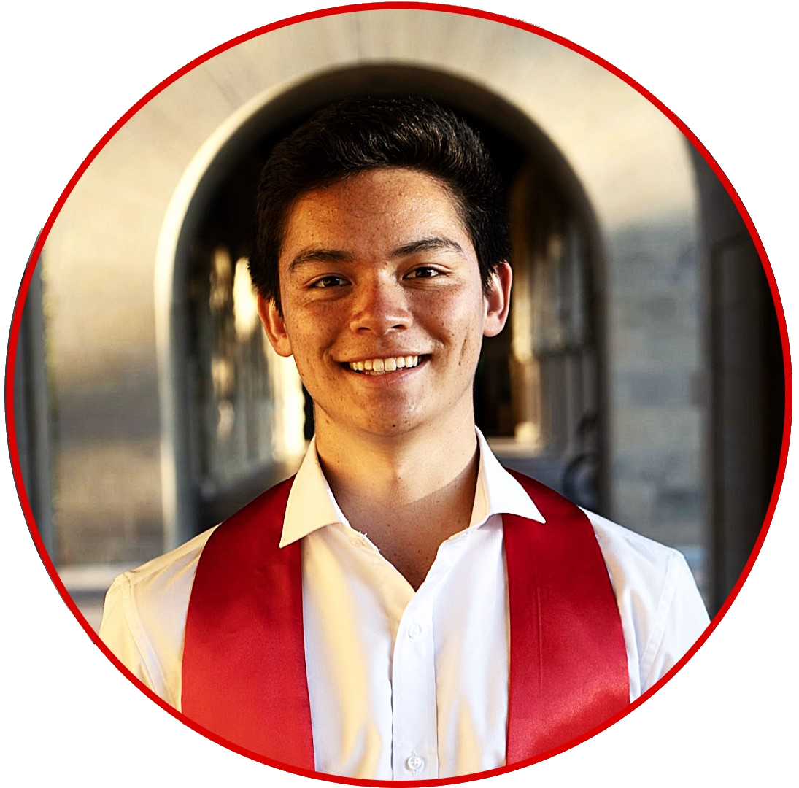

---
# Feel free to add content and custom Front Matter to this file.
# To modify the layout, see https://jekyllrb.com/docs/themes/#overriding-theme-defaults

layout: page
---

**Quantum Optomechanics** at [Painter Lab](https://painterlab.caltech.edu/){:target="_blank"} $$\vert$$ Hybrid Quantum Systems $$\vert$$ Distributed Quantum Computing

Hello there!

My name is Ricky Parada and I'm a 1st year Applied Physics Ph.D. student at Caltech. Advised by Prof. Oskar Painter, my research involves engineering optomechanical devices with applications to hybrid quantum architectures consisting of acoustic and superconducting quantum circuits.

As an undergrad/coterminal master's student at Stanford, I modeled quantum state propagations in open networks using SLH with [Mabuchi Lab](https://mabuchilab.org/){:target="_blank"}, experimentally reconstructed the phase diagram of Vanadium under the supervision of Prof. [David Goldhaber-Gordon](https://web.stanford.edu/~goldhab/){:target="_blank"}, and computed correction curves for energy/momentum distributions of cuprate superconductors at [Shen Laboratory](https://arpes.stanford.edu){:target="_blank"}. Check out my [research page](https://rickyparada.github.io/research) for more information.

I am a proud Angeleno from Glendale, California. I love travel (especially visiting family in Mexico/Thailand), playing soccer, long distance running, and solving Rubik's cubes (particularly while blindfolded). I also enjoy playing games (tabletop, rhythym, or any Mario franchise installment), listening to music (classic rock and banda most recently), and improving my piano playing abilities. Don't hesitate to reach me at [rparada@caltech.edu](mailto:rparada@caltech.edu) with any questions!

<a href="mailto:rparada@caltech.edu" title="email"><i class="fa-solid fa-envelope fa-2x"></i></a>
<a href="https://scholar.google.com/citations?user=j7NyAisAAAAJ&hl" title="Google Scholar"><i class="ai ai-google-scholar fa-2x"></i></a>
<a href="https://github.com/rickyparada6" title="GitHub"><i class="fa-brands fa-github fa-2x"></i></a>
<a href="https://www.linkedin.com/in/rickyparada" title="LinkedIn"><i class="fa-brands fa-linkedin fa-2x"></i></a>
<a href="https://orcid.org/0000-0003-2264-1100" title="ORCID"><i class="ai ai-orcid ai-2x"></i></a>

