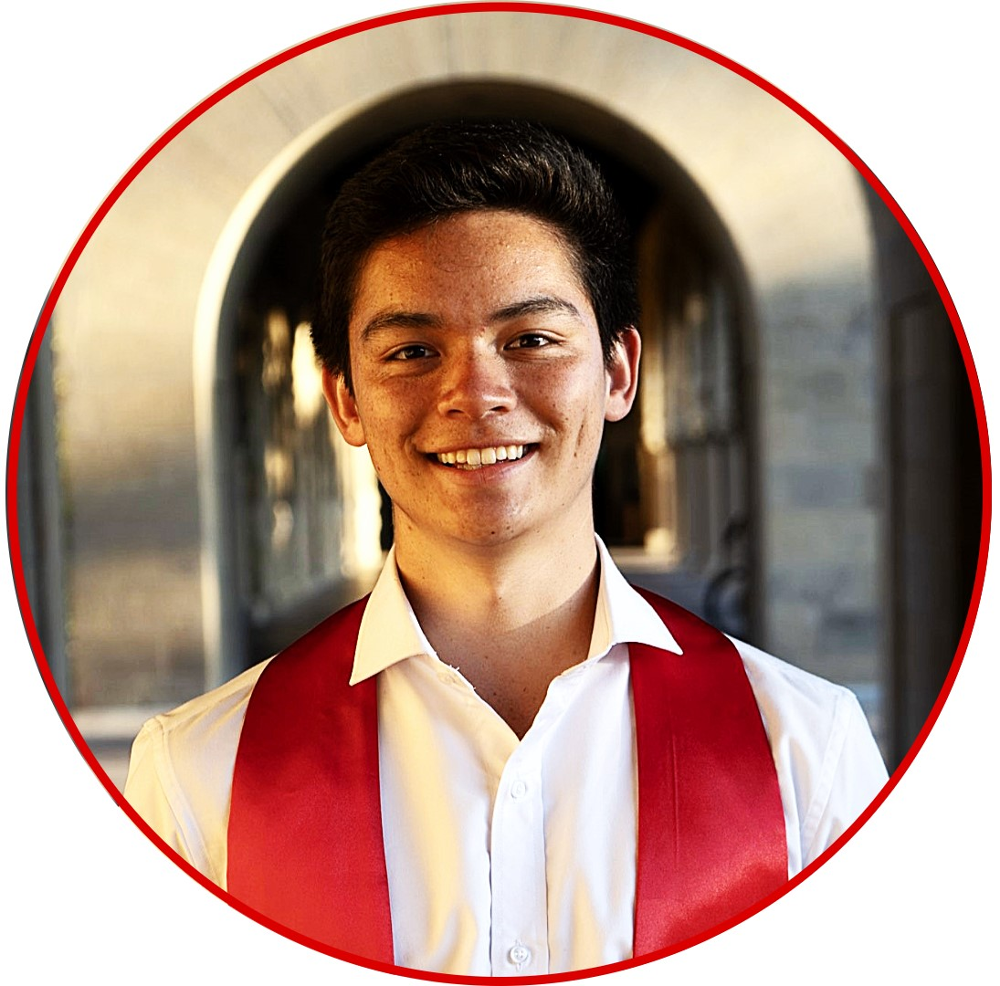

---
# Feel free to add content and custom Front Matter to this file.
# To modify the layout, see https://jekyllrb.com/docs/themes/#overriding-theme-defaults

layout: page
---

**Quantum I/O Modeling** at [Mabuchi Lab](https://mabuchilab.org/) $$\vert$$ Hybrid Quantum Systems $$\vert$$ Distributed QC

Hello there!

My name is Ricky Parada and I'm a Coterminal Master's student at Stanford University. As an undergrad, I studied Engineering Physics with a specialization in Quantum Science and Engineering (QSE). I'll be graduating in Spring 2024 with an MS in Computer Science (theory specialization). My research interests lie broadly in the experimental design of hybrid quantum systems with distributed computing and quantum networking applications.

I'm currently working at [Mabuchi Lab](https://mabuchilab.org/) on quantum state propogation modeling in open networks using SLH. Last summer, I worked on quantum transduction research at [Painter Lab](https://painterlab.caltech.edu/) as a Caltech SURF fellow, designing a qubit module for high fidelity state transfer from optomechanical transducers. I've previously classified birefringent materials using optics-trained Neural Networks (NNs) at [Herrera Lab](https://fherreralab.com/), obtained correction curves for cuprate superconductors at [Shen Laboratory](https://arpes.stanford.edu), and designed real-world environments using Machine Learning (ML) at Autonomous UAV company [Beyond Vision](https://beyond-vision.pt/). Check out my [research page](https://rickyparada.github.io/research) for more information.

I am a proud Angeleno hailing from Glendale, California. I love travel (especially visiting family in Mexico/Thailand), playing soccer, long distance running, and solving Rubik's cubes (particularly while blindfolded). I also enjoy playing games (tabletop, rhythym, or any Mario franchise installment), listening to music (classic rock, Disney, Taylor Swift, ...), and improving my piano playing abilities. Don't hesitate to reach me at [rparada@stanford.edu](mailto:rparada@stanford.edu) with any questions!

<a href="mailto:rparada@stanford.edu" title="email"><i class="fa-solid fa-envelope fa-2x"></i></a>
<a href="https://scholar.google.com/citations?user=j7NyAisAAAAJ&hl" title="Google Scholar"><i class="ai ai-google-scholar fa-2x"></i></a>
<a href="https://github.com/rickyparada6" title="GitHub"><i class="fa-brands fa-github fa-2x"></i></a>
<a href="https://www.linkedin.com/in/rickyparada" title="LinkedIn"><i class="fa-brands fa-linkedin fa-2x"></i></a>
<a href="https://orcid.org/0000-0003-2264-1100" title="ORCID"><i class="ai ai-orcid ai-2x"></i></a>

